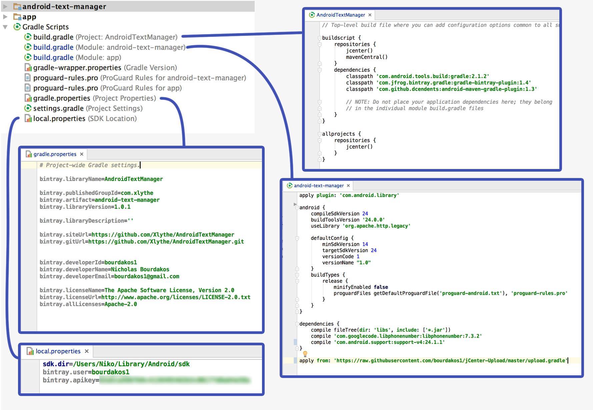
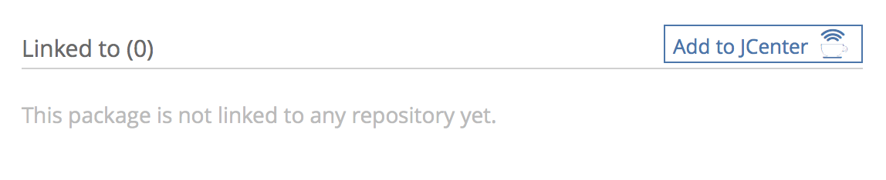

# jCenter-Upload
Step-by-step instructions for uploading to jCenter

## Create a Bintray account
https://bintray.com

## Gradle


In your Project's build.gradle make sure you have the following dependencies:
```groovy
dependencies {
        classpath 'com.android.tools.build:gradle:2.1.2'
        classpath 'com.jfrog.bintray.gradle:gradle-bintray-plugin:1.4'
        classpath 'com.github.dcendents:android-maven-gradle-plugin:1.3'
}
```

In the next step you will need to provide some information about your library. Some of this information includes your ``GroupId`` your ``artifact`` and your ``libraryVersion`` they can be whatever you like, but normally look something like this:
```groovy
dependencies {
        compile 'com.xlythe:android-text-manager:1.0.0'
                (groupId:artifact:libraryVersion)
}
```

In your Project's gradle.properties add the following:
```properties
bintray.libraryName=LibraryName

bintray.groupId=your.group.id
bintray.artifact=artifact-name *This must match your modules name*
bintray.libraryVersion=librarys.version

bintray.libraryDescription=your library description

bintray.siteUrl=your website url
bintray.gitUrl=your git url

bintray.developerId=your id
bintray.developerName=your name
bintray.developerEmail=your email address

bintray.licenseName=The Apache Software License, Version 2.0
bintray.licenseUrl=http://www.apache.org/licenses/LICENSE-2.0.txt
bintray.allLicenses=Apache-2.0
```

At the very end of your library module's build.gradle add:
```groovy
apply from: 'https://raw.githubusercontent.com/bourdakos1/jCenter-Upload/master/upload.gradle'
```

Finally, in local.properties add the following:
```properties
bintray.user=your bintray username
bintray.apikey=your bintray apikey
```

## Upload
Run ```./gradlew bintrayUpload``` in your projects terminal

## Linking to jCenter
This final step only needs to be completed the first time you upload your library.

Login to your https://bintray.com account and click on your recently uploaded repository.

On the bottom of the page you should see an add to JCenter button


Click on it and then just click send. It will take a few hours before your library is approved.
